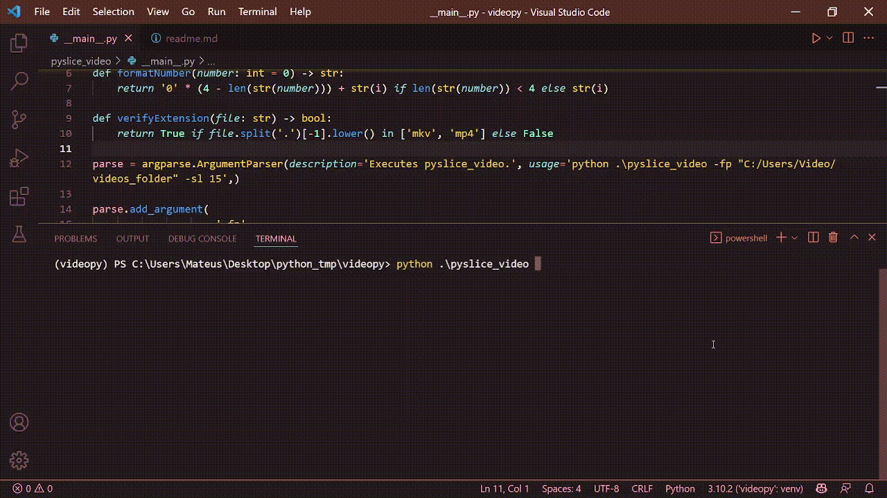

Script to slice a group of videos in a specific time interval.
To use this script you should have installed [Python3](https://www.python.org/downloads/) and a lib called [moviepy](https://pypi.org/project/moviepy/).

